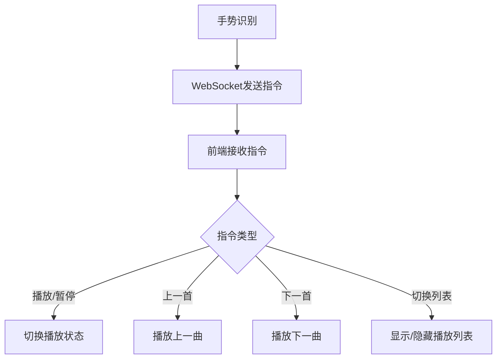

## 1. 产品概述
这是一个简单的React音乐播放器demo，用于信息系统设计课程作业的手势识别应用展示。用户可以通过手势控制（通过WebSocket接收指令）来播放存储在IndexedDB中的本地音乐文件。

## 2. 核心功能

### 2.1 功能模块
音乐播放器demo包含以下核心页面：
1. **主播放页面**：音乐播放控制、当前播放信息显示
2. **播放列表页面**：显示已添加的音乐列表

### 2.2 页面详情

| 页面名称 | 模块名称 | 功能描述 |
|---------|---------|---------|
| 主播放页面 | 播放控制区 | 显示当前播放歌曲信息（歌名、歌手），提供播放/暂停、上一首、下一首按钮 |
| 主播放页面 | 状态显示区 | 显示播放状态（播放/暂停）、当前播放进度 |
| 播放列表页面 | 音乐列表 | 显示所有已添加的音乐文件，支持点击切换播放 |
| 播放列表页面 | 添加音乐 | 提供文件选择器添加本地音乐文件到IndexedDB |

## 3. 核心流程

### 手势控制流程
1. 嵌入式后端通过手势识别生成控制指令
2. 前端通过WebSocket接收JSON格式的控制指令
3. 前端解析指令并执行相应的播放控制操作



### 音乐管理流程
1. 用户通过文件选择器添加本地音乐文件
2. 前端将音乐文件（blob）和元数据存储到IndexedDB
3. 播放时从IndexedDB读取音乐文件进行播放

## 4. 用户界面设计

### 4.1 设计风格
- **主色调**：现代简洁风格，使用Tailwind CSS默认配色
- **按钮样式**：圆角矩形按钮，hover效果
- **字体**：系统默认字体，简洁易读
- **布局**：居中对齐，卡片式布局

### 4.2 页面设计概览

| 页面名称 | 模块名称 | UI元素 |
|---------|---------|---------|
| 主播放页面 | 播放控制区 | 大圆形播放/暂停按钮，左右两侧小圆形上一首/下一首按钮 |
| 主播放页面 | 歌曲信息 | 居中显示歌曲名称和歌手，使用较大字体 |
| 播放列表页面 | 音乐列表 | 简洁的列表项，显示歌曲名，点击高亮当前播放 |

### 4.3 响应式设计
采用桌面优先设计，适配不同屏幕尺寸，确保在课程演示时界面清晰易用。

## 5. WebSocket通信协议

### 5.1 连接配置
- 协议：`ws://`
- 端口：由后端指定（默认8080）
- 心跳机制：每30秒ping一次

### 5.2 指令格式
所有指令采用JSON格式，结构如下：

```json
{
  "action": "play_pause|previous|next|toggle_list",
  "timestamp": 1234567890
}
```

### 5.3 指令说明
- **play_pause**: 切换播放/暂停状态
- **previous**: 播放列表中上一首歌曲
- **next**: 播放列表中下一首歌曲  
- **toggle_list**: 显示/隐藏播放列表

## 6. IndexedDB数据存储

### 6.1 数据库结构
- 数据库名称：`MusicPlayerDB`
- 对象存储：`songs`
- 主键：自动生成的ID

### 6.2 存储数据格式
```javascript
{
  id: auto-generated,
  name: "歌曲名称",
  artist: "歌手名称", 
  file: Blob, // 音乐文件二进制数据
  duration: 0, // 播放时长（秒）
  addedAt: timestamp
}
```

### 6.3 基本操作
- **添加**：选择本地音乐文件后存储到IndexedDB
- **读取**：播放时从IndexedDB读取文件数据
- **删除**：从播放列表中移除音乐（可选功能）
- **查询**：获取所有已添加的音乐列表