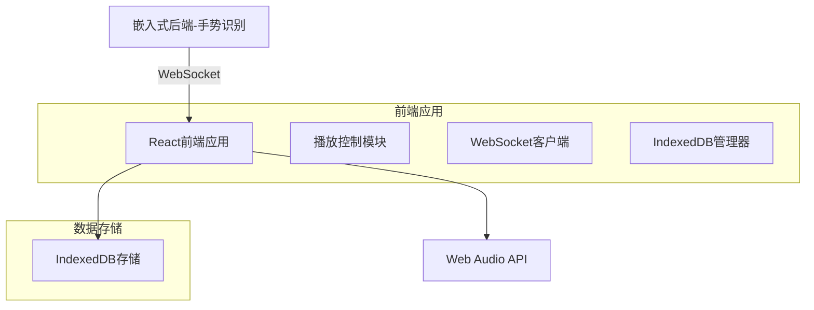
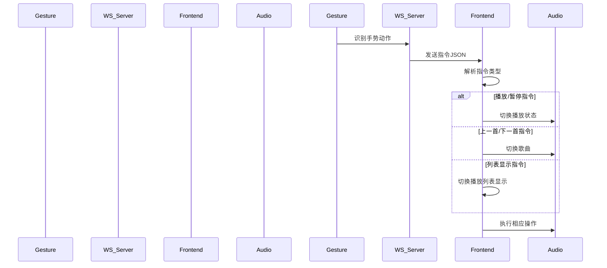

## 1. 架构设计



## 2. 技术描述

- **前端**: React@18 + TailwindCSS@3 + Vite
- **初始化工具**: vite-init
- **后端**: 无（WebSocket服务器由嵌入式后端提供）
- **存储**: IndexedDB（浏览器原生API）
- **音频播放**: Web Audio API / HTML5 Audio

### 核心依赖
```json
{
  "dependencies": {
    "react": "^18.2.0",
    "react-dom": "^18.2.0"
  },
  "devDependencies": {
    "@types/react": "^18.2.0",
    "@types/react-dom": "^18.2.0",
    "@vitejs/plugin-react": "^4.0.0",
    "tailwindcss": "^3.3.0",
    "vite": "^4.4.0"
  }
}
```

## 3. 路由定义

| 路由 | 用途 |
|------|------|
| / | 主播放页面，显示播放器和控制按钮 |
| /playlist | 播放列表页面，显示所有音乐和管理功能 |

## 4. WebSocket API定义

### 4.1 连接管理
```javascript
// WebSocket连接配置
const ws = new WebSocket('ws://localhost:8080');

// 连接事件
ws.onopen = () => console.log('WebSocket连接已建立');
ws.onmessage = (event) => handleGestureCommand(JSON.parse(event.data));
ws.onclose = () => console.log('WebSocket连接已关闭');
ws.onerror = (error) => console.error('WebSocket错误:', error);
```

### 4.2 指令格式定义

**接收指令**（前端接收）：
```typescript
interface GestureCommand {
  action: 'play_pause' | 'previous' | 'next' | 'toggle_list';
  timestamp: number;
}
```

**心跳包**（前端发送）：
```typescript
interface HeartbeatPacket {
  type: 'ping';
  timestamp: number;
}
```

## 5. IndexedDB架构设计

### 5.1 数据库管理器
```typescript
class MusicDB {
  private dbName = 'MusicPlayerDB';
  private storeName = 'songs';
  private version = 1;
  
  async initDB(): Promise<IDBDatabase>;
  async addSong(song: SongData): Promise<void>;
  async getAllSongs(): Promise<SongData[]>;
  async getSongById(id: number): Promise<SongData | null>;
  async deleteSong(id: number): Promise<void>;
}

interface SongData {
  id?: number;
  name: string;
  artist: string;
  file: Blob;
  duration: number;
  addedAt: number;
}
```

### 5.2 音频播放管理
```typescript
class AudioPlayer {
  private audio: HTMLAudioElement;
  private currentSong: SongData | null;
  private playlist: SongData[];
  private currentIndex: number;
  
  play(): void;
  pause(): void;
  previous(): void;
  next(): void;
  loadSong(song: SongData): void;
  getCurrentTime(): number;
  getDuration(): number;
}
```

## 6. 组件架构

### 6.1 主要组件
```typescript
// 主播放器组件
const MusicPlayer: React.FC = () => {
  // 状态管理：播放状态、当前歌曲、播放列表
  // WebSocket连接管理
  // 手势指令处理
};

// 播放列表组件
const Playlist: React.FC = () => {
  // 音乐列表显示
  // 文件上传处理
  // IndexedDB操作
};

// 控制按钮组件
const ControlButtons: React.FC<ControlProps> = ({ onPlayPause, onPrevious, onNext }) => {
  // 播放控制按钮渲染
};
```

### 6.2 状态管理
使用React useState和useEffect管理：
- 播放状态（播放/暂停）
- 当前播放歌曲
- 播放列表
- WebSocket连接状态
- IndexedDB初始化状态

## 7. 手势指令处理流程



## 8. 错误处理

### 8.1 WebSocket错误
- 连接失败：显示错误提示，尝试重连
- 消息格式错误：忽略无效消息，记录日志
- 连接断开：自动重连机制

### 8.2 IndexedDB错误
- 数据库初始化失败：降级到内存存储
- 文件存储失败：提示用户检查浏览器权限
- 数据读取失败：清空并重置数据库

### 8.3 音频播放错误
- 文件格式不支持：提示用户选择其他格式
- 解码失败：跳过当前歌曲
- 网络中断（如适用）：暂停播放等待恢复